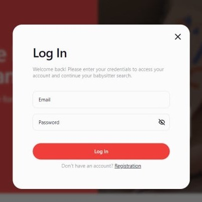

  #  Nanny.Services

"Nanny.Services" is a web application designed to connect users with available nannies. It allows users to browse through a list of nannies, filter them based on various criteria, and registered users can add or remove their favorite nannies. The application also provides features for user authentication, allowing users to register, login, and manage their profiles.

### Pages

**1. Home**

- Welcomes users with a site title, company slogan, and a call-to-action button redirecting to the "Nannies" page.

**2. Nannies**

- Lists available nannies. Each nanny card includes essential details and a "Read more" button for expanded information.
- Supports sorting (alphabetically A-Z, Z-A), filtering by price, and sorting by popularity.
- Features dynamic loading of nanny cards with a "Load more" button.
- Allows authenticated users to add nannies to favorites.

**3. Favorites**

- Private page accessible to authenticated users.
- Allows users to view and manage their favorite nannies.

## Features

- **User Authentication**: Firebase authentication for registration, login, and logout.
- **Adaptive Design**: Fluid layout for breakpoints at 320px, 375px, 768px, and 1440px. Ensures compatibility and usability across various devices.
- **Modal Dialogs**: Used for login/registration/logout and appointment scheduling.
- **Form Validation**: Implemented using React Hook Form and Yup for client-side validation.

 

## About the Project

[**Layout**](https://www.figma.com/design/u36ajEOsnwio2GDGiabVPD/Nanny-Sevices?node-id=0-1&t=InhTF7JPicvjF7lI-0) |
[**Technical Task**](https://docs.google.com/document/d/19ugM1gvOw81nCyALr4EZs3dmv6OfJm94VjupcytbnJY/edit)

## Technologies Used

## Deployment

This project is deployed on Vercel. Check it out: [**Nanny.Services**](https://nanny-services-sigma.vercel.app/)
